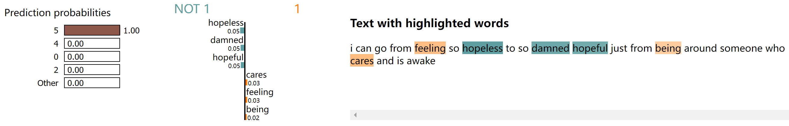
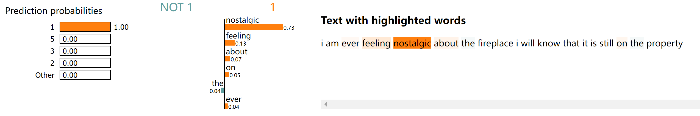
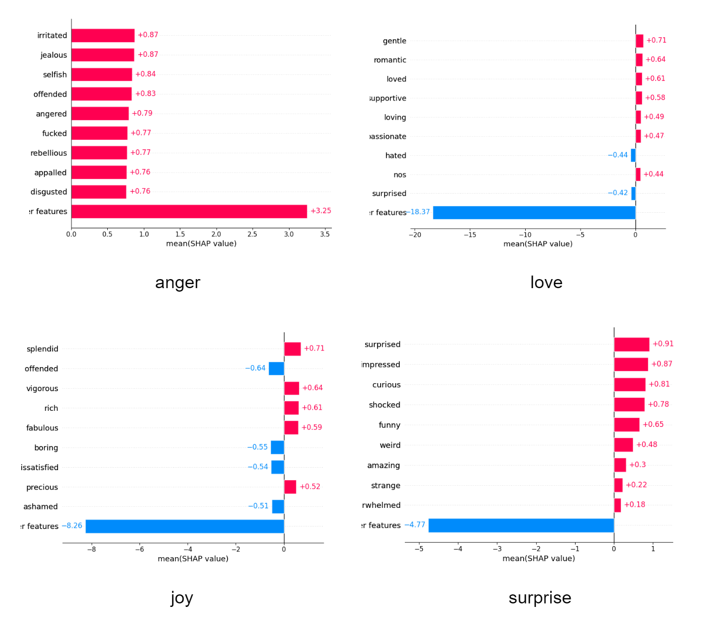
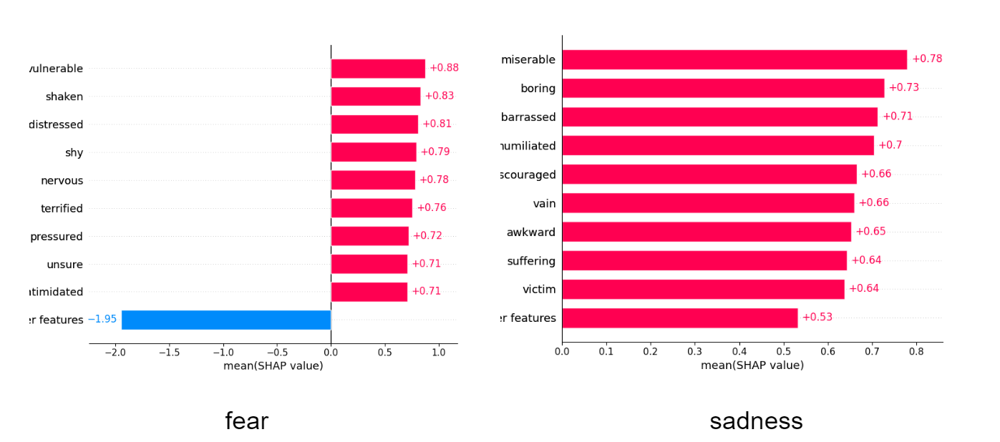

# NLP Final Project

## Introduction

In this project, we are trying to explore the effectiveness of machine learning models for multiclass emotion classification on a textual dataset. The dataset comes from Kaggle (https://www.kaggle.com/datasets/praveengovi/emotions-dataset-for-nlp), which contains labeled text samples belonging to six distinct emotions (sadness, fear, angry, joy, love, surprise), and the goal is to develop a model that accurately classifies these emotions.

## How to train the models

* LSTM+CNN model

  This model is implemented in the **Code/emotions_LSTM.py**. Go into the folder and run the code directly.

* Transform (DistilBert) model

  This model is implemented in the **Code/transformer_model.py**. Go into the code and make sure the parameter of **model_bert_lstm = False** in line 32.

* Transform model with LSTM head

  This model is implemented in the **Code/transformer_model.py**. Go into the code and make sure the parameter of **model_bert_lstm = True** in line 32.

## Model Interpretation

The model interpretation only works in Transform (DistilBert) model. So make sure **model_bert_lstm = False** if you want to get the results of model interpretation.

* Sample LIME result

* Sample SHAP result

